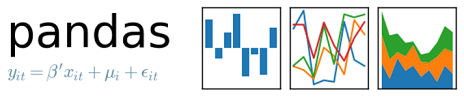
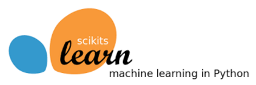

# ML-Notebooks  
  
-------------------------------------------------------------------------------------------  
  
-------------------------------------------------------------------------------------------  
  
-------------------------------------------------------------------------------------------  
  
--&nbsp;&nbsp;&nbsp;&nbsp;&nbsp;Matplotlib  
&nbsp;&nbsp;&nbsp;--&nbsp;&nbsp;Matplotlib.Pyplot  
&nbsp;&nbsp;&nbsp;&nbsp;&nbsp;--Matplotlib.Pyplot.Plot  
&nbsp;&nbsp;&nbsp;&nbsp;&nbsp;--Matplotlib.Pyplot.Scatter  
