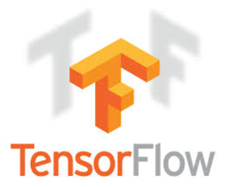

# Jupyter-Notebooks  
Collection of Jupyter Notebooks for various Python, Machine Learning, and Deep Learning Topics  

  
------------------------------------------------------------------------------------------- 
  
-------------------------------------------------------------------------------------------  
  
-------------------------------------------------------------------------------------------  
  
-------------------------------------------------------------------------------------------  
  
-------------------------------------------------------------------------------------------  
  
-------------------------------------------------------------------------------------------  
  
